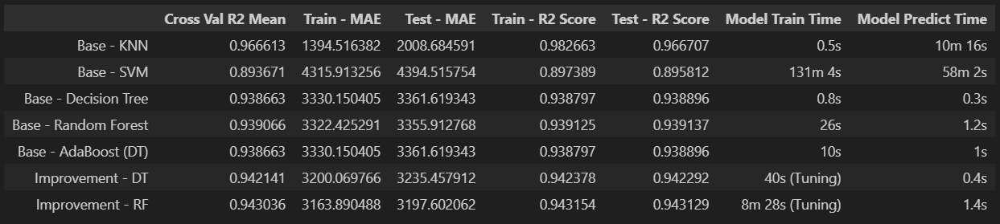

# Flight-Price-Prediction
This repository contains an supervised machine learning project to predict the flight prices in India. The project is designed to help traveler to predict their ticket price, so they can determine the airlines, departure times and prices that are efficient for them.

## Project Overview
Flight Price Prediction project aims to predict flight price in India based on the the flights time, duration, destination and when the ticket bought using machine learning with `Regression Algorithm`. By analyzing the flights history data and identifying patterns, the project can help traveler to predict their ticket price, so they can determine the airlines, departure times and prices that are efficient for them. The project involves exploratory data analysis, data cleaning & preprocessing, feature engineering, model training & evaluation and model improvement.

## Tools and Technologies
- Python
- Jupyter Notebook
- Pandas
- Matplotlib
- Seaborn
- Scikit-learn
- Pipeline
- Streamlit

## File Description
- `Flight_Price_Prediction.ipynb` : Jupyter Notebook containing the code used for data cleaning, exploratory data analysis, feature engineering, model training & evaluation and model improvement.
- `Flight_Price_Prediction_Inference.ipynb` : Jupyter Notebook containing the code for model inference testing.
- `flight_price_prediction.csv` : CSV file containing the data of Flights History.
- `deployment/` : Folder containing the code for model deployment.

## Algorithm Used
- K-Nearest Neighbors Regressor
- Support Vector Machines Regressor
- Decision Tree Regressor
- Random Forest Regressor
- AdaBoost Regressor

## Result

Above are the result of model evaluation and model improvement.

- From all five baseline model, `KNN` model give the best result compared to the other four with 96% R2 Score of Cross Validation Mean. How ever this model predict time is more than 10 mins even with only base parameter. So we will choose our second best model with lower predict time which is `Decision Tree` and `Random Forest` to improve. Both of this still have 93% R2 Score of Cross Validation Mean as baseline model but much less resource needed, so we can say this model is the most efficient.

- After Hyperparameter Tuning, The result of `Decision Tree` is 94.2% R2 Score of Cross Validation Mean, this is a bit better than the baseline model which only give 93.8% R2 Score. Then `Random Forest` result after hyperparameter tuning is 94.3% R2 Score of Cross Validation Mean, this is also a bit better than its baseline model which only have 93.9% R2 Score.

- Based on the R2 Score of Cross Validation mean between `Decision Tree Improvement` and `Random Forest Improvement` we decide to define **`Random Forest Improvement`** as the **best model** to use. Because `Random Forest Improvement` has a better R2 Score of Cross Validation Mean. Although `Random Forest Improvement` predict time is longer than `Decision Tree Improvement` but the difference between the two is only 1 second and `Random Forest Improvement` also has better MAE at 3200 for train-set and 3163 for test-set.

## Conclusion
The Flight Price Prediction project was able to successfully predict the flight price with an `R2Score` of `94.3%` and `1.4 second` predict time. The project identified the most important features that influcences the flight price and created a predictive model that can be used to predict the price for future flight. These can be used by Airlines to help them to evaluate their ticket price by comparing it with their competitor.

## Acknowledgements
The Flight History data used in this project was obtained from [Kaggle](https://www.kaggle.com/datasets/shubhambathwal/flight-price-prediction)

Model Deployment for this project on [Hugging Face](https://huggingface.co/spaces/gilangw/flight_price_predictor)
